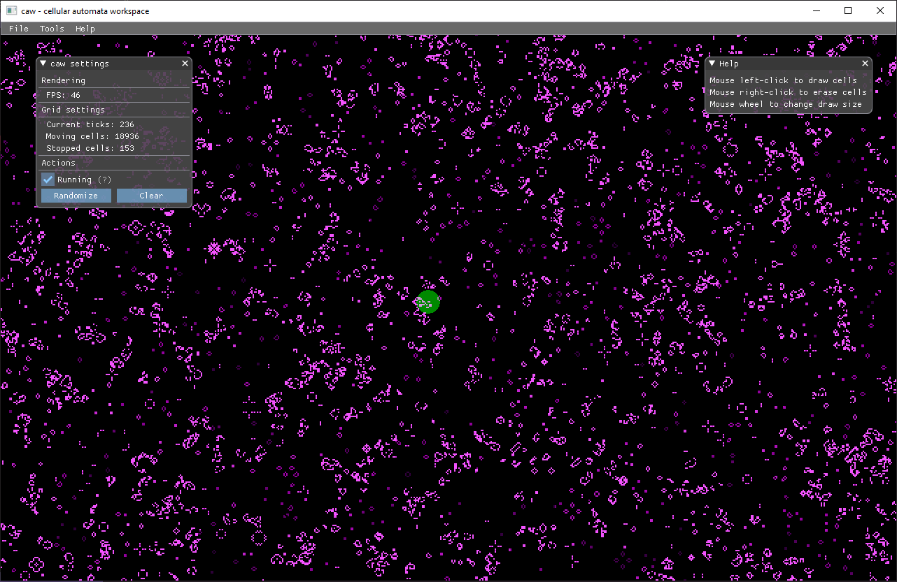

## caw - cellular automata workspace

This is a small app to simulate some known **cellular automata**, as Game of Life or Wireworld.

It serves as an experiment for using the ggez game engine, with imgui bindings.

For now, only Game of Life is simulated.

## How to start

`cargo run --release`